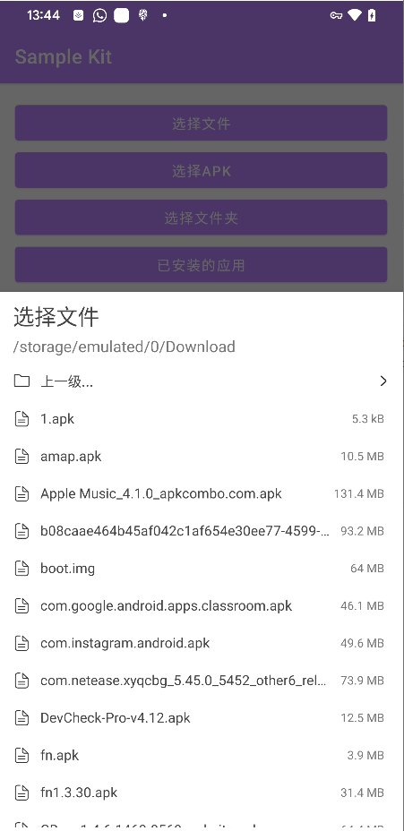
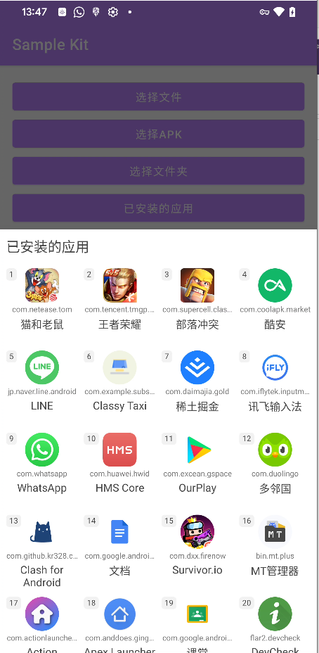

# Sample Kit

用于快速实现示例程序的功能性UI套件


## Gradle

```
implementation 'com.vmos:sample-kit:1.0.6'
```


## 文件选择

```
// title = 标题
// fileSuffixes = new String[]{".apk"} // 只有符合文件后缀的才可以选择，null则不限制
// supportUseDirectory = true/false // true则支持选择文件夹 false只能选择文件
DeviceFileSelectorDialog.newInstance(title, fileSuffixes, supportUseDirectory)
        .setOnFileSelectorListener(new DeviceFileSelectorDialog.OnFileSelectorListener() {
            @Override
            public void onFileSelected(FileItem item) {
                setMessage(item.getAbsolutePath());
            }
        })
        .show(getSupportFragmentManager());
```



## 获取已安装应用

```
// title = 标题
new DeviceInstalledAppDialog(title)
        .setOnClickInstalledItemListener((item, position) ->
                // 点击Item后的监听
        .show(getSupportFragmentManager());
```

